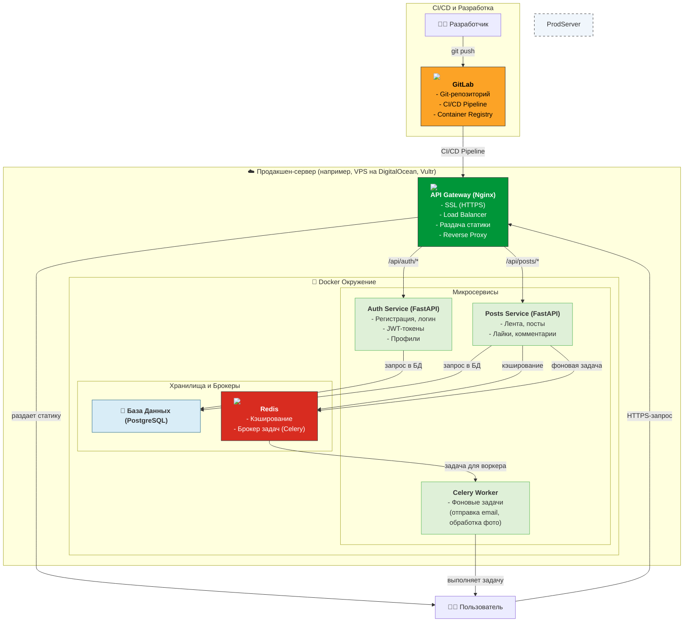

```mermaid
flowchart TD
    %% --- ВНЕШНИЕ СИСТЕМЫ И ПОЛЬЗОВАТЕЛИ ---
    
    subgraph "CI/CD и Разработка"
        Developer["👨‍💻 Разработчик"]
        GitLab["<img src='https://about.gitlab.com/images/press/logo/png/gitlab-icon-rgb.png' width='30' /> <b>GitLab</b>\n- Git-репозиторий\n- CI/CD Pipeline\n- Container Registry"]
    end

    User["👩‍💻 Пользователь"]

    %% --- ПРОДАКШЕН-СЕРВЕР ---

    subgraph "☁️ Продакшен-сервер (например, VPS на DigitalOcean, Vultr)"
        style ProdServer fill:#f0f6fc,stroke:#333,stroke-dasharray: 5 5
        
        Nginx["<img src='https://www.nginx.com/wp-content/uploads/2018/08/nginx-logo-rgb-large.png' width='25' /> <b>API Gateway (Nginx)</b>\n- SSL (HTTPS)\n- Load Balancer\n- Раздача статики\n- Reverse Proxy"]

        %% --- DOCKER Окружение ---
        subgraph "🐳 Docker Окружение"
            
            %% -- Микросервисы --
            subgraph "Микросервисы"
                AuthService["<b>Auth Service (FastAPI)</b>\n- Регистрация, логин\n- JWT-токены\n- Профили"]
                PostsService["<b>Posts Service (FastAPI)</b>\n- Лента, посты\n- Лайки, комментарии"]
                Worker["<b>Celery Worker</b>\n- Фоновые задачи\n(отправка email, обработка фото)"]
            end
            
            %% -- Базы данных и брокеры --
            subgraph "Хранилища и Брокеры"
                DB["<b>🐘 База Данных (PostgreSQL)</b>"]
                Redis["<img src='https://redis.io/images/redis-white.png' width='20' /> <b>Redis</b>\n- Кэширование\n- Брокер задач (Celery)"]
            end
        end
    end

    %% --- ПОТОКИ ДАННЫХ ---
    
    %% Разработка и деплой
    Developer -->|git push| GitLab
    GitLab -->|CI/CD Pipeline| Nginx
    
    %% Пользовательский трафик
    User -->|HTTPS-запрос| Nginx
    Nginx -->|раздает статику| User
    Nginx -->|/api/auth/*| AuthService
    Nginx -->|/api/posts/*| PostsService
    
    %% Внутренние взаимодействия
    AuthService -->|запрос в БД| DB
    PostsService -->|запрос в БД| DB
    PostsService -->|кэширование| Redis
    PostsService -->|фоновая задача| Redis
    Redis -->|задача для воркера| Worker
    Worker -->|выполняет задачу| User
    
    %% --- СТИЛИЗАЦИЯ (безопасная) ---
    classDef gitlab fill:#fca326,stroke:#333,color:black
    classDef nginx fill:#009639,stroke:#333,color:white
    classDef redis fill:#d82c20,stroke:#333,color:white
    classDef service fill:#dff0d8,stroke:#5cb85c
    classDef db fill:#d9edf7,stroke:#31708f

    class GitLab gitlab
    class Nginx nginx
    class Redis redis
    class AuthService,PostsService,Worker service
    class DB db
```