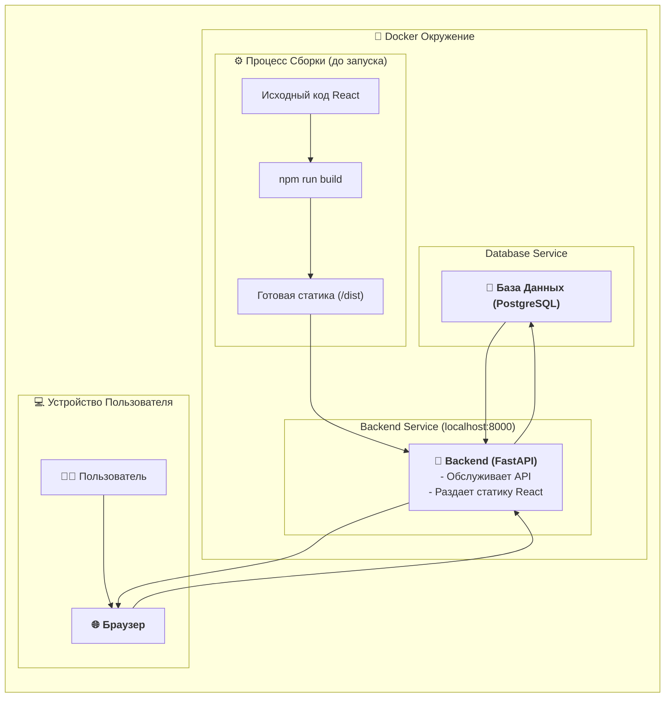

```mermaid
flowchart TD
    %% --- БЛОКИ ---
    subgraph " "
        direction TB
        subgraph "💻 Устройство Пользователя"
            User["👨‍💻 Пользователь"]
            Browser["<b>🌐 Браузер</b>"]
        end

        subgraph "🐳 Docker Окружение"
            subgraph "⚙️ Процесс Сборки (до запуска)"
                direction LR
                ReactCode["Исходный код React"]
                BuildCmd["npm run build"]
                DistFolder["Готовая статика (/dist)"]
                ReactCode --> BuildCmd --> DistFolder
            end

            subgraph "Backend Service (localhost:8000)"
                Backend["<b>🐍 Backend (FastAPI)</b>\n- Обслуживает API\n- Раздает статику React"]
            end

            subgraph "Database Service"
                DB["<b>🐘 База Данных (PostgreSQL)</b>"]
            end

            DistFolder --> Backend
        end
    end
    
    %% --- СВЯЗИ (БЕЗ ТЕКСТА) ---
    User --> Browser
    Browser --> Backend
    Backend --> Browser
    Backend --> DB
    DB --> Backend
```